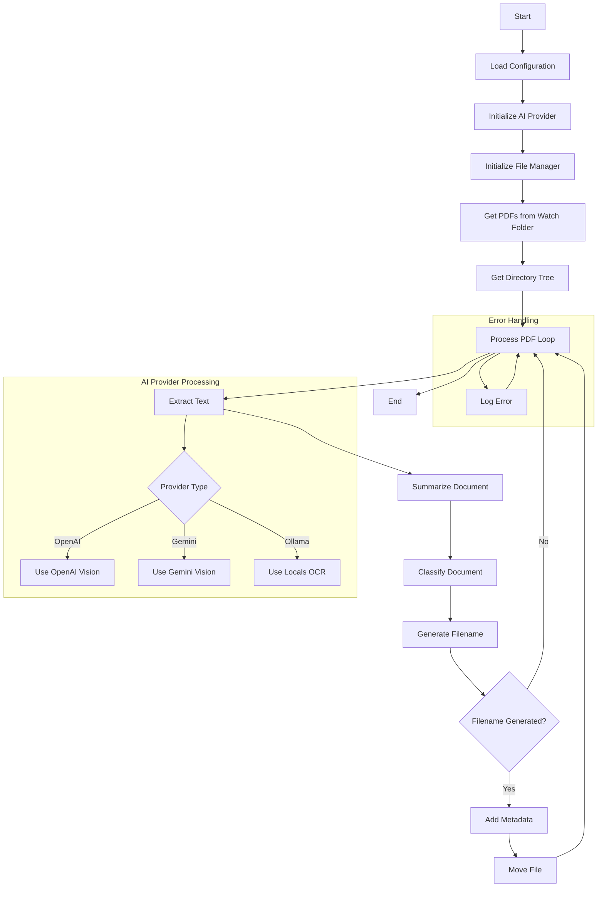

# AI Filer Program Flow

## Flow Description

1. **Initial Setup**
   - Load configuration from file or environment
   - Initialize appropriate AI provider (OpenAI, Gemini, or Ollama)
   - Set up file management system

2. **Main Processing Loop**
   - Scan watch folder for PDF files
   - Get destination directory structure
   - Process each PDF file

3. **PDF Processing**
   - Extract text using provider-specific method
   - Generate document summary
   - Classify document
   - Generate descriptive filename

4. **File Operations**
   - Add metadata to PDF
   - Move file to classified location

5. **Error Handling**
   - Log errors during processing
   - Continue with next file 